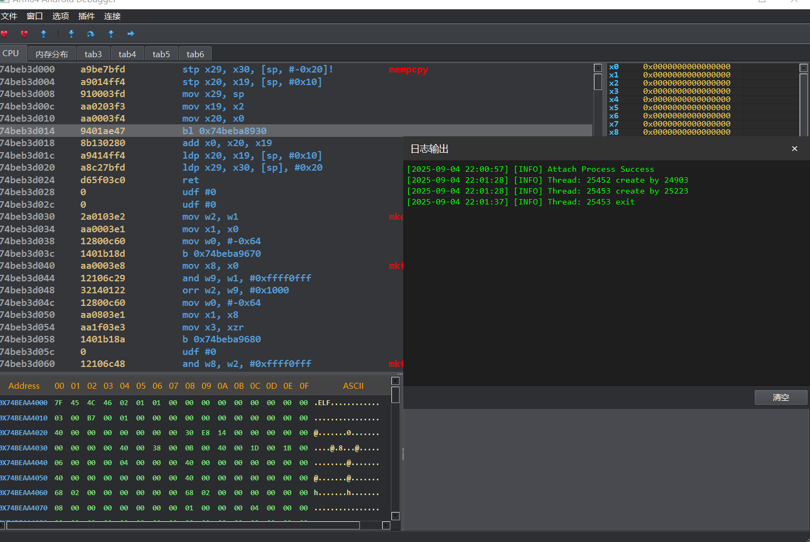

# 图片展示：




# 基于 Android 驱动自建调试体系：架构、实现与实践

> TL;DR：我基于 Android 内核驱动自建了一套完整的用户态/内核态协同调试体系，支持**硬件断点**、**软件断点**、**单步调试**、**异常接管**、**线程生命周期追踪**、**mmap/so 加载追踪**、**读写寄存器/内存**等能力。硬件断点实现**不依赖内核现成接口**，可避开目标进程占满硬件资源的干扰，同时降低被检测的概率。所有事件都以“**捕获即暂停**”的模型上报至用户层，由用户层决定是否恢复执行。

---

## 1. 背景与目标

游戏与高安全场景常常屏蔽或占用内核调试接口，导致常规 ptrace/perf/hw_breakpoint 路线不可用或易被检测。我的目标是：

- 构建**可控、低耦合、低可检测性**的调试体系；
- 覆盖**线程/模块生命周期**与**指令级控制**（步进、断点）；
- 在**不依赖内核现成调试 API**的前提下实现**硬件断点**；
- 用户层无法捕获到调试的事件。

---

## 2. 总体架构

系统被划分为三部分：

```
+-----------------+          IOCTL             +--------------------+          RPC / SOCKET          +----------------+
|  Android 驱动   |  <---------------------->   |  Android 服务端    |  <------------------------->  |  客户端 (Qt)   |
| (Kernel Module) |                              | (User-space Daemon)|                                 |  Debug Frontend |
+-----------------+                              +--------------------+                                 +----------------+
       ^  ^                                                  ^  ^                                              ^  ^
       |  | 事件/寄存器/内存 IOCTL                            |  | 调试逻辑/状态机                               |  | 
       |  +--------------------------------------------------+  +----------------------------------------------+  |
       |                                                                                                         |
       +------------------------------------- 统一事件模型 -----------------------------------------------<------+
```

- **驱动层**：暴露 ioctl/字符设备接口；负责断点、步进、异常接管、线程创建与退出、 mmap 事件捕获、寄存器/内存访问，同时提供**暂停和恢复线程的接口**（不使用信号暂停与恢复）。
- **服务端（Android Daemon）**：封装调试逻辑和状态机，维护断点表、目标线程集、事件队列，对外提供 RPC。
- **客户端（Qt）**：面向用户的交互界面；提供可视化的图形和按钮，发送调试指令，展示寄存器/内存/模块等信息。

---

## 3. 已实现能力一览

- **硬件断点**：不使用内核现有接口（如 perf/hw_breakpoint），直接按需配置相关寄存器路径，规避“目标进程占满硬断点”的限制；降低被检测概率。
- **软件断点**：通过**异常接管**实现（插入断点指令并在异常路径暂停线程），目标用户态不可捕获由本调试器触发的异常。
- **单步调试**：驱动层控制，命中后以事件形式上报，由上层决定继续、步入、步过。
- **线程追踪**：捕获**线程创建/退出**事件，维护活动线程集合。
- **mmap/so 追踪**：拦截 mmap 调用，将来可用于支持**so 加载监控**与模块基址维护。
- **异常接管**：统一异常入口，分类标注来源（软件断点/硬件断点/单步/其他），并暂停触发线程。
- **寄存器/内存读写**：支持对**被暂停线程**进行寄存器成组读写；支持安全的用户内存读写。
- **主动暂停/恢复线程**: 支持直接暂停与恢复线程，不通过信号。
- **可设置追踪事件选项**： 可以设置调试选项来追踪特定事件，如线程创建与退出、mmap事件、异常接管等事件可通过驱动提供的接口设置选择追踪或不追踪。
- **统一事件语义**：任何调试事件一律**先暂停**，再上报；调试器显式“恢复”后才放行。

---

## 4. 事件生命周期（Event Flow）

```
 [触发点: 硬断/软断/单步/异常/线程创建与退出/mmap]
                |
                v
        (A) 驱动捕获事件 -> 标准化结构体 (type, tid, fault_address, reserve...)
                |
                v
        (B) 线程置于暂停态 (thread stop)
                |
                v
        (C) 上报服务端 (将事件加入事件队列)
                |
                v
        (D) 客户端不断获取队列事件 (RPC)
                |
                v
 [客户端策略] Continue / Step / Kill / ModifyRegs / ReadWriteMem ...
                |
                v
        (E) 服务端下发命令 -> 驱动执行 -> 目标线程恢复或继续暂停
```

- **确定性**：同一事件只会被上报一次；客户端需要自己控制线程。

---

## 5. 硬件断点设计要点（AArch64 概览）

> 仅概述思路，不包含敏感实现细节。

- **不经由内核公共接口**：在合规前提下，自行管理调试相关控制路径（如对断点/监视点寄存器对的分配、保存/恢复、上下文切换时机）。
- **对抗资源占满**：目标进程即使已占用内核对外暴露的断点资源，仍可由本系统配置生效。
- **上下文安全**：在线程切换、异常进入/返回时，对断点状态做**保存/恢复**以避免串扰。
- **隐蔽性**：减少可被用户态/常规安全检测到的痕迹（如不暴露可枚举的 perf 事件）。

> 备注：硬件细节涉及特定平台寄存器、异常级与权限模型，需遵守设备与区域法规、授权及合规要求。

---

## 6. 软件断点与异常接管

- **软件断点**：在目标指令处写入断点指令；异常触发后，由驱动**优先处理**并暂停线程，用户态应用**无法捕获**该异常。
- **异常分类**：区分触发来源（SW/HW/Step/其他），在事件中包含 PC、线程 ID、事件种类等关键信息，事件命中后，可通过驱动接口获取寄存器信息。
- **PC 修正与恢复**：提供“恢复执行时是否调整 PC”选项，确保继续执行的语义正确。

---

## 7. 线程与模块（so）追踪

- **线程**：在创建/退出路径安装钩子（内核层），维护活动线程表，便于 UI 展示以及定位命中线程。
- **mmap/so**：拦截 mmap；当检测到**可执行映射**或 ELF 装载行为时，提取路径、基址、区间，更新模块表。

---

## 8. 未来将实现的功能

- 条件断点与命中脚本
- 内存断点，实现对内存访的访问监控，实现模拟硬件断点达到无限硬件断点的效果。
- 调用栈采集与符号化
- 更细粒度的 so 加载与卸载事件
- 监控所有系统调用，如**kill**与**exit、exitgroup**等，监控系统调用**执行前**与**执行完**。
- **SPAWN**调试
- 更丰富的 GUI（如线程列表、断点列表）